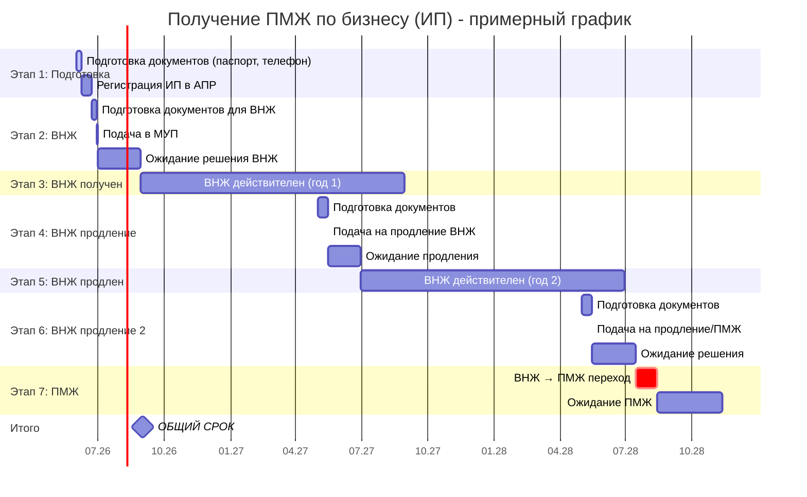
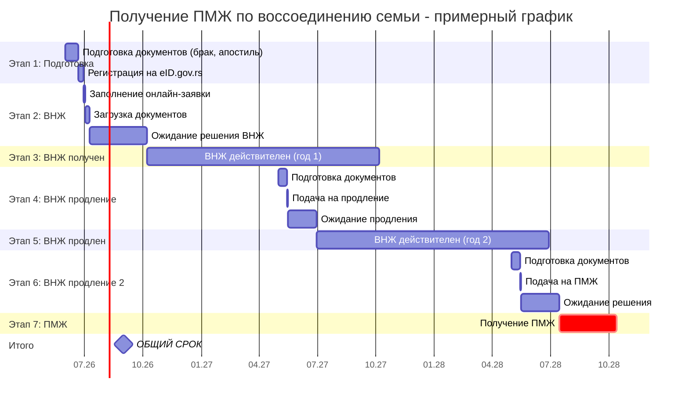
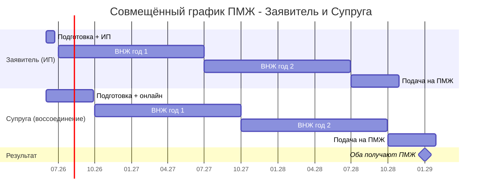

# Инструкция по получению ПМЖ в Сербии

## Общие положения

Перед подачей на ПМЖ необходимо выполнить одно из условий:
- **Непрерывное пребывание** в течение 3 лет на основании временного вида на жительство (ВНЖ)
- **Брак с гражданином Сербии** — 3 года совместного проживания
- **Воссоединение семьи** — 3 года ВНЖ на основании воссоединения с супругом, имеющим ПМЖ

**Важно:** Перед походом в МУП нужно написать на email, указать всех членов семьи, кто планирует подавать на ПМЖ, и запросить термин.

---

## ВАРИАНТ 1: ПМЖ по бизнесу (через ИП / Предузетник)

### Условия для подачи

1. У вас должно быть зарегистрировано ИП (Предузетник) в Сербии
2. Вы должны иметь непрерывный ВНЖ на основании ИП в течение 3 лет
3. Ежегодно нужно подтверждать деятельность ИП (подавать финансовые отчёты)

### Этап 1: Регистрация ИП (если ещё не сделано)

1. **Подготовка документов:**
   - Загранпаспорт
   - Сербский номер телефона (+381)
   - Сербский email

2. **Подача заявления через portal.apr.gov.rs:**
   - Выбрать «Предузетник» (Preduzetnik)
   - Выбрать коды деятельности (ОКВЭД)
   - Выбрать систему налогообложения (паушальная рекомендуется)
   - Указать адрес деятельности

3. **Оплата госпошлины** — около 3.000 динаров

4. **Получение решений** — через 7-14 дней

### Этап 2: Получение ВНЖ по ИП

1. Записаться на приём в МУП (Ministarstvo unutrašnjih poslova)
2. Подготовить документы:
   - Загранпаспорт
   - Решение о регистрации ИП
   - Договор аренды или документ на недвижимость
   - Доказательства дохода (выписка со счёта)
   - Медицинская страховка
3. Подать заявление — ВНЖ выдаётся на 1-3 года

### Этап 3: Подача на ПМЖ

#### Список документов для ПМЖ по ИП

**Для каждого члена семьи — отдельная папка документов. Порядок: фото + квитанции → заявление → остальное.**

| № | Документ | Примечание |
|---|---------|-----------|
| 1 | Фотография | 35×45 мм, цветная, открытое лицо, белый фон |
| 2 | Заявление (Aпликација) | Заполнить сербской латиницей ЗАГЛАВНЫМИ БУКВАМИ, на компьютере или от руки. Подпись — для детей оба родителя. Печать на обеих сторонах листа |
| 3 | Квитанция об оплате госпошлины | Оплатить в банке или через e-banking |
| 4 | Автобиография | Детям не требуется |
| 5 | Копия загранпас��орта | Все страницы (включая страницы с визами) |
| 6 | Копия сербской ID-карты | Обе стороны |
| 7 | Решение о регистрации ИП | Оригинал + копия |
| 8 | Доказательства деятельности ИП | Финансовые отчёты за 3 года |
| 9 | Договор аренды/прописка | Подтверждение адреса проживания |
| 10 | Выписка из банка | Подтверждение финансовой состоятельности |

#### Порядок действий

1. **Записаться на термин** в МУП по email (указать ФИО всех подающих)
2. **Оплатить госпошлины** — квитанции приложить к каждому комплекту
3. **Подготовить документы** — проверить сроки действия, перевод на сербский язык где требуется
4. **Явиться в МУП** в назначенное время
5. **Сдать документы** — сотрудник проверит и примет
6. **Ожидать решение** — обычно 1-3 месяца

---

## ВАРИАНТ 2: ПМЖ по воссоединению семьи (для супруги)

### Условия для подачи

1. Супруг(а) имеет ПМЖ в Сербии
2. У супруги есть действующий ВНЖ на основании воссоединения семьи
3. Непрерывное пребывание в течение 3 лет на ВНЖ

**Альтернатива:** Если супруг — гражданин Сербии, то подать можно после 3 лет брака и совместного проживания.

### Этап 1: Получение ВНЖ по воссоединению семьи

Если ещё нет ВНЖ:

1. **Онлайн-подача** через eid.gov.rs
2. **Необходимые документы:**
   - Загранпаспорт
   - Свидетельство о браке (апостилированное + перевод)
   - Подтверждение ПМЖ супруга
   - Договор аренды с указанием супруги
   - ID-карта супруга (копия)
   - Справка о доходах супруга

3. **Ожидание** — 2-4 месяца

### Этап 2: Подача на ПМЖ

#### Список документов для ПМЖ по воссоединению

**Для каждого члена семьи — отдельная папка. Порядок: фото + квитанции → заявление → остальное.**

| № | Документ | Примечание |
|---|---------|-----------|
| 1 | Фотография | 35×45 мм, цветная, открытое лицо, белый фон |
| 2 | Заявление (Aпликација) | Заполнить сербской латиницей ЗАГЛАВНЫМИ БУКВАМИ. Печать на обеих сторонах листа |
| 3 | Квитанция об оплате госпошлины | Оплатить в банке |
| 4 | Автобиография | Взрослым |
| 5 | Копия загранпаспорта | Все страницы |
| 6 | Копия сербской ID-карты | Обе стороны |
| 7 | Свидетельство о браке | Оригинал или нотариально заверенная копия, с апостилем и переводом |
| 8 | Решение о ВНЖ | Копия всех предыдущих ВНЖ |
| 9 | Договор аренды/прописка | Подтверждение совместного адреса |
| 10 | Выписка из банка | Подтверждение финансовой состоятельности |

#### Особенности для жены

- Если супруга подаёт单独的 на ПМЖ (без мужа), нужно доказать:
  - Совместное проживание
  - Финансовую зависимость от супруга с ПМЖ
  - Семейные узы

- **Обязательно присутствие обоих родителей** при подаче за детей

#### Дополнительные документы для детей (если есть)

| № | Документ | Примечание |
|---|---------|-----------|
| 1 | Свидетельство о рождении | С апостилем и переводом на сербский |
| 2 | Согласие второго родителя | Нотариально заверенное, если родители в разводе |
| 3 | Решение о ВНЖ ребёнка | Копия |
| 4 | Фото | 35×45 мм |

---

## Госпошлины и сборы

| Наименование | Сумма (дин.) |
|--------------|--------------|
| Подача на ПМЖ (государственная пошлина) | ~5.000 |
| Изготовление карты ПМЖ | ~2.000 |
| Итого | ~7.000 |

_Оплата производится в банке (Poštanska štedionica или коммерческий банк) по реквизитам, которые выдадут в МУП._

---

## Частые ошибки и советы

### Ошибки
1. **Неправильный порядок документов** — сотрудник может отказать в приёме
2. **Отсутствие апостиля** на документах — требуется для свидетельств
3. **Неверная подпись** — для детей должны подписать оба родителя
4. **Просроченный паспорт** — должен быть действителен ещё min 6 месяцев

### Советы
1. **Заранее записывайтесь на термин** — очереди большие
2. **Делайте копии всех документов** — по 2 экземпляра
3. **Проверяйте переводы** — делайте у сербского нотариуса
4. **Не покидайте Сербию более 6 месяцев** подряд — могут аннулировать ПМЖ
5. **Минимум 2 дня в году** проводите в Сербии — иначе могут отклонить ПМЖ

---

## Контакты

- **МУП (Министерство внутренних дел):** mu.gov.rs
- **АПР (Реестр предприятий):** apr.gov.rs
- **Вопросы по записи:** write to your local MUP email

---

_Дата создания: 2026-05-08_

_Источники: srb.guide, welcometoserbia.org, russian.rs, migration law Serbia_

---

## Диаграмма Ганта: Получение ПМЖ в Сербии

### График для заявителя (по бизнесу через ИП)

---

### График для жены (по воссоединению семьи)

---

### Совмещённый график (параллельно)

